# Task Local Storage

Pros-rs uses a custom made TLS (Task Local Storage) implementation to allow for arbitrary TLS entries.
FreeRTOS TLS has a maximum number of entries. It is configurable, but the default is only 5.
Because the FreeRTOS TLS api is horribly unsafe and the maximum number of entries is 5,
we use a custom implementation based off of the FreeRTOS api.

The custom implementation works by placing a pointer to a pros-rs TLS type in the FreeRTOS TLS.
Pros-rs puts this always pointer in slot 0 of tls so that we can easily find it.\
Here is a flow chart that goes over the basic idea of the implementation:  

In order to guarantee that every `LocalKey` has a unique index into the pros-rs TLS that works on every task,
a static atomic u32 is used as a semaphore.
Every time a `LocalKey` is created it will get the current value of the next index semaphore and increment it by one.
the index that it got from the semaphore is guaranteed to be unique on all threads because the semaphore is static and atomic.

### Drawbacks

Unfortunately, because of the fundamental design of this implementation, in order to access any value in TLS you must go through two pointers.
Also when a task is destroyed for any reason, all entries in pros-rs TLS are leaked and cannot be freed.
The leaking issue could be fixed by using `Box::from_raw` and dropping the returned value when the TLS struct is dropped,
but that hasn't been implemented just yet.