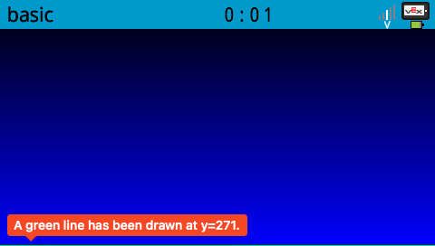
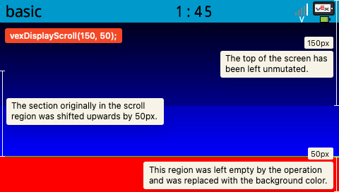
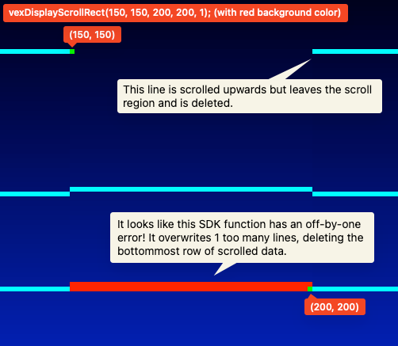
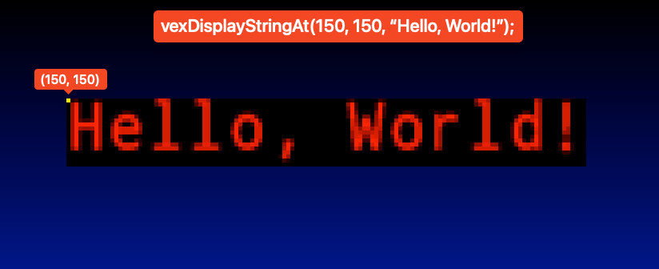
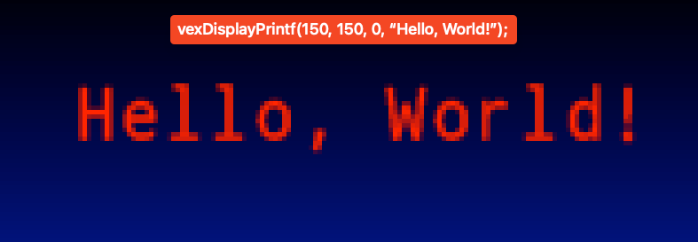
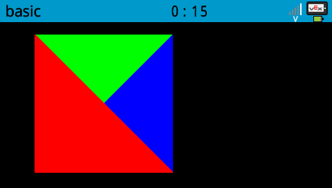
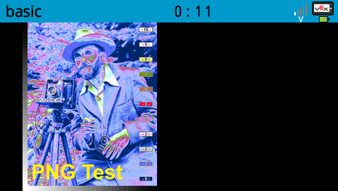

# Display SDK Notes

The Vex V5 SDK contains functions for drawing to the V5’s 480 × 272 pixel LCD screen. The origin point of the display is at the top left, and the point `(479, 271)` is at the bottom right.

## Code Signature

Several publicly released code signature options affect the operation of the display.

- `V5_SIG_OPTIONS_INDG` (`1 << 0`): Inverts the background color to pure white.
- `V5_SIG_OPTIONS_THDG` (`1 << 2`): If VEXos is using the Light theme, inverts the background color to pure white.

If both options are enabled at once, the themed option will win and the background will stay black if the V5 is using the Dark theme.

## Foreground and background colors

Foreground and background colors can be set using `vexDisplayForegroundColor` and `vexDisplayBackgroundColor`. These colors will then be used for all future display calls unless changed again. In all programs, the foreground starts off-white (`#c0c0ff`). By default, the background starts black (`#000000`) but this isn’t guaranteed and can be changed using the program’s code signature. Colors are `u32`s in the format `0x00RRGGBB` where `R`, `G`, and `B` are the red, green, and blue components.

## Erasing

`vexDisplayErase` acts similarly to `vexDisplayRectFill` but uses the background color instead and always fills the entire screen. As with other drawing-related functions, portions of the screen that are outside the clip region will not be modified.

## Scrolling

`vexDisplayScroll*`-form methods move a region of the screen `nLine` pixels upwards, without affecting portions of the screen outside the specified scroll region. Since `nLine` is a signed integer, a negative value will move the pixels in the region downwards instead. Pixels that move outside the region being scrolled are discarded, and any portions of the region that no longer have a value after the operation are set to the background color.

The `vexDisplayScroll` function scrolls the region defined by all the pixels whose y-axis coordinate is within the range `[nStartLine, 272)`. Consider a brain with the following image displayed on the screen:



Running `vexDisplayScroll` with `nStartLines` set to `150` and `nLines` set to `50` would result in the following:



The operation does not edit the top `nStartLine` (150) pixels because they are outside the scroll region. The pixels inside the scroll region are moved up by `nLines` (50) pixels (and discarded if they would modify a portion of the screen outside said scroll region). The operation leaves `nLines` (50) pixels of empty space at the bottom, which is subsequently filled with the background color (in this case it was set to a shade of red).

`vexDisplayScrollRect` works similarly, but allows you to specify a more detailed scroll region. The parameters passed to the function are inclusive, so the points you passed will be included inside the scroll region. However, it appears to be somewhat bugged at the time of writing: it overwrites one too many lines, setting the bottommost row of scroll data to the background color.



## Copying image buffers

`vexDisplayCopyRect` is used to copy many pixels to the display at once from a pixel buffer outside the display. Each u32 element in the buffer is considered a pixel and is parsed in the same format used by `vexDisplayForegroundColor`. The function allows you to specify the region to write to, the pointer to your image buffer, and the stride (or the number of u32 pixels in your buffer per 1 row).

## Rectangles

The parameters of `vexDisplayRect*`-form methods are inclusive, meaning that the coordinate pairs you specify are inside the rectangle that is created. Thus, the area of a rectangle created with this set of SDK functions is `(1 + x2 - x1) * (1 + y2 - y1)` pixels.

## Circles

Circles are not antialiased.

## Text



Text can be displayed using one of the many `printf`-style functions in the Display SDK. Most of them have 2 variants: line-based, and coordinate-based. The origin of coordinate-based text is its top-left corner. Line-based text functions are equivalent to calling their coordinate-based form with the x-coordinate `0` and the y-coordinate `34 + (20 * nLineNumber)`.

Transparent text can be drawn using `vexDisplayPrintf` with its `bOpaque` parameter set to `0`.



## Image reading

Using the SDK, images can be parsed from the BMP and PNG container formats to their raw pixel buffers for use with `vexDisplayCopyRect`. `vexImage*` functions require the caller to allocate a data buffer that the parsed pixel data will be stored in and then pass it as an out-parameter. Thus, the caller must commit to a maximum image size and pre-allocate a buffer that could hold that largest possible image before calling interacting with this portion of the SDK. The `maxh` and `maxw` parameters used by these SDK functions must, when multiplied, equal the number of `u32` pixels that could fit in the data buffer.

### The `v5_image` struct

The `v5_image` struct is used as an out-parameter by the `vexImage*` family of SDK functions.

Its fields consist of:

- `data`: This field must be set before the read operation as a pointer to the pre-allocated pixel buffer. After an image read operation, said image’s pixels are written to the location specified by this field.
- `width` and `height`: These will be set by the SDK by the end of a successful image read operation and are the definitive width and height of the image that was loaded. In contrast to `maxh` and `maxw`, these convey the actual number of pixels written rather than the maximum capacity of the pixel buffer.
- `p`: This field is only set by the SDK after a `vexImageBmpRead` call and appears to point to the first pixel of the second row in the pixel buffer.

### BMP images

BMP-formatted images can be read using the `vexImageBmpRead` function. It returns `0` on failure and `1` on success.



#### BMP reading safety

- `ibuf` must be null, OR the buffer it points to must begin with a well-formed BMP image. Because the function does not take a buffer length argument, the only way it could know the size of the image is by relying on the header of `ibuf` being valid.
- `oBuf` must point to an initialized `v5_image` struct or null.
- `(*oBuf).data` must point to a mutable allocated image buffer that is at least `maxw * maxh * 4` bytes long or be null.

#### BMP reading postconditions

- If the image read operation failed, the function returns `0`.
- If the image read operation was successful, the function returns `1` and `oBuf` is updated as described in [The `v5_image` struct](#the-v5_image-struct).

### PNG images

PNG-formatted images can be read using the `vexImagePngRead` function. It returns `0` on failure and `1` on success.



#### PNG reading safety

- `ibuf` must be null, OR point to a buffer of at least length `ibuflen`
- `oBuf` must point to an initialized `v5_image` struct or null.
- `(*oBuf).data` must point to a mutable allocated image buffer that is at least `maxw * maxh * 4` bytes long or be null.

#### PNG reading postconditions

- If the image read operation failed, the function returns `0`.
- If the image read operation was successful, the function returns `1` and `oBuf` is updated as described in [The `v5_image` struct](#the-v5_image-struct).

## Clip regions

The clip region is the region of the screen that the current VEX thread can modify. It can be updated using the `vexDisplayClipRegionSet` function, or changed for a different thread using `vexDisplayClipRegionSetWithIndex`. In that case, the `index` parameter must a `0`-indexed thread ID.

## Double buffering

By default, LCD updates are written directly to the display. In cases where the display is updating quickly (such as in a loop), this can cause flickering issues due to the lack of VSync. Calling `vexDisplayRender` every frame resolves this issue by enabling double-buffer mode and only updating the display when it is called. Later calling `vexDisplayDoubleBufferDisable` will return the display to its direct mode.

When calling `vexDisplayRender`, enabling the `bVsyncWait` parameter will sleep the current thread until the screen is ready to refresh, and enabling the `bRunScheduler` parameter will run background tasks while waiting.

## Font and text size

The text drawn by the `vexDisplayPrintf` function can be customized in size and font. To choose a font, the `vexDisplayFontNamedSet` function can be called with a parameter of either `"monospace"` or `"proportional"`, specifying either a fixed-width font or a variable-width font.

Similiarly, the `vexDisplayTextSize` function can be used to customize the size of the text by specifying a fractional font size. For example, passing `1` and `2` will set the text to be ½ of "full size," and passing `2` and `3` will set the text to be ⅔ of full size.

The default configuration is the `monospace` font at ⅓ size.

Utility functions like `vexDisplayBigString` will change the font size to a preset value:

- Big (`vexDisplayBigString` or `fontType::monoXL`): `vexDisplayTextSize(2, 3)`
- Normal (`vexDisplayString` or `fontType::monoM`): `vexDisplayTextSize(1, 3)`
- Small (`vexDisplaySmallStringAt` or `fontType::monoS`): Seems to be around `vexDisplayTextSize(1, 4)`

The string measuring functions `vexDisplayStringWidth`/`Height` will use the current font family and font size when calculating text height and width.

```rs
// Draw "Hello, world!" at (50, 50) in 1/4 size
// in the proportional font with no background color:
vexDisplayFontNamedSet(c"proportional".as_ptr());
vexDisplayTextSize(1, 4); // small, 1/4 of full size
vexDisplayPrintf(50, 50, false as i32, "Hello, world!");
```
