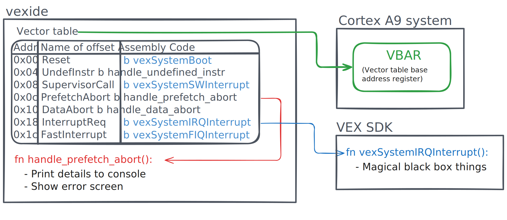
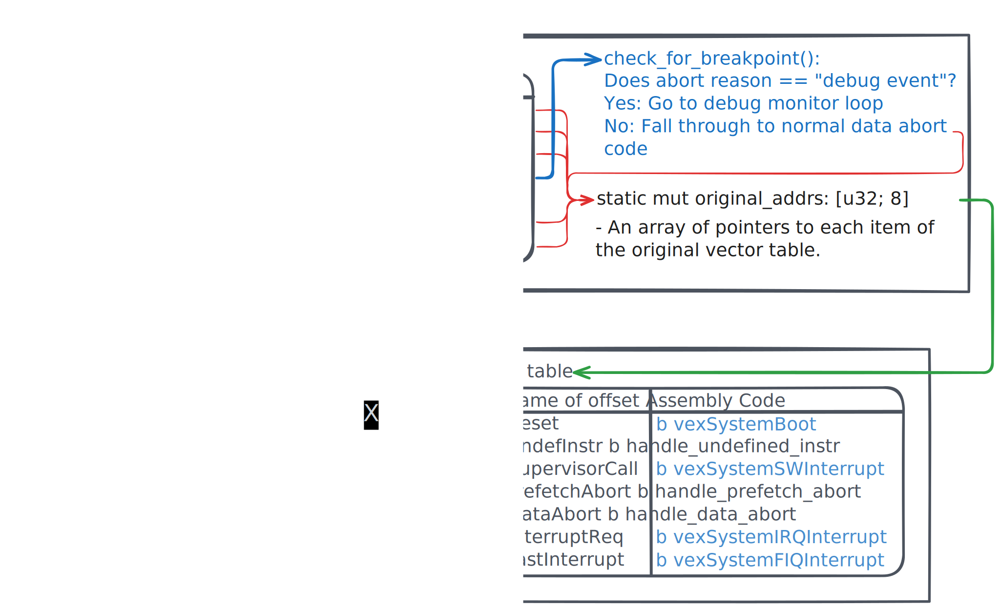

# VEX V5 Debugger

Despite [long-term interest](https://www.vexforum.com/t/debugger-for-vex-v5/91619) by the VEX community, there is currently no complete on-device debugger for the VEX V5 platform.

However, there has been some past work on implementing one on previous VEX platforms. For instance, the ROBOTC language and framework (which targeted the VEX Cortex platform) included a feature-rich [graphical debugger](https://www.robotc.net/WebHelpVEX/index.htm#Resources/topics/ROBOTC_Debugger/Program_Debugging.htm) that took advantage of the language's virtual machine environment. Additionally, the PROS project, also targeting the Cortex, initially included a prototype of a real-time, key/value dashboard called "JINX Debugger" (despite not including the traditional features of a [debugger](https://en.wikipedia.org/wiki/Debugger)). Ultimately, neither ROBOTC nor JINX were ported to the more recent VEX V5.

Notably, another more recent project is Interfiber's [v5dbg](https://github.com/Interfiber/v5dbg), a debugger for PROS programs that allows developers to define breakpoints at compile time using some C++ macro magic and function calls. It also allows users to manually expose variables so they can be viewed when their breakpoints are hit. Unfortunately, due to v5dbg's architecture, users cannot step through lines of code or place arbitrary breakpoints at runtime. Additionally, developers must update their existing code to take advantage of the debugger's features.

In order to bring a full debugger to the VEX V5 platform, [we are working on implementing](https://github.com/vexide/vexide/tree/feat/v5-debugger/packages/v5-debugger) a GDB backend for VEX V5. This library takes advantage of the Cortex A9's advanced hardware debug functionality, adding the ability to place breakpoints in arbitrary locations and view variables without explicit code changes. While we are prioritizing ease of use in vexide, we plan to bring the vexide debugger to the PROS and VEXcode frameworks in the future.

## Debugger overview

This section gives a high-level overview of the architecture of this project.

### Resources

Those interested in contributing are highly encouraged to download a copy of the [ARMv7-A Reference Manual](https://developer.arm.com/documentation/ddi0406/latest) and optionally the [Cortex-A9 Manual](https://documentation-service.arm.com/static/5e8e2ab9fd977155116a7035?token=). These cover some important details about debug events, debug registers, and the CPU's exception model. Also, it might be helpful to look at the [Zynq 7000 Reference](https://docs.amd.com/viewer/book-attachment/mxcNFn1EFZjLI1eShoEn5w/~F6mCjSrb3_BDetD7782sA-mxcNFn1EFZjLI1eShoEn5w) for information about the device's memory map and configuration registers.

### ARMv7-A debugging model

The VEX V5 is built around the Zynq 7000 system-on-chip, running user code on one of its dual ARM Cortex-A9 processors. Since all user code is run in System mode (aka ring 0 or kernel mode), it is free to manage processor state such as the debug architecture. The debugger library uses this ability to configure the CPU just as a real operating system would.

The ARMv7-A debug architecture is controlled by various registers that the CPU checks to determine where, when, and how to cause breakpoints. These registers can be accessed through [Coprocessor #14](https://developer.arm.com/documentation/den0013/0400/ARM-Architecture-and-Processors/Architecture-history-and-extensions/Coprocessors) (cp14), but require special assembly instructions for each one - accessing each numbered hardware breakpoint would have to be its own line of code, for instance. The alternative is the memory-mapped I/O interface, which lets you access processor state like any other global integer or array. For the most part, this is what the vexide debugger uses to access hardware state: it reads and saves the address of the MMIO interface from cp14 when it initializes.

The debugging process itself is centered around *debug events*, which can occur whenever a breakpoint, watchpoint, or `bkpt` assembly instruction are triggered. Depending on the CPU state, debug events will either be ignored (the default), cause the CPU to halt (for debugging with a probe device), or induce a debug exception that can be handled by the operating system. The V5's array of hardware breakpoints is limited, so, for the most part, we just dynamically edit programs to replace certain instructions with `bkpt`. Whenever they're hit, a debug event is triggered just as if a real breakpoint had been there. When we want to continue, we can replace the `bkpt` instruction with whatever was there before and return from the exception handler. This approach is called [software breakpoints](https://en.wikipedia.org/wiki/Breakpoint#Software) because it doesn't require the use of the hardware's dedicated breakpoint registers.

Hardware breakpoints do have their uses, though, because they can be configured to trigger when the processor _isn't_ executing a targeted instruction rather than just when it is doing so. For instance, if the debugger wanted to single-step past an instruction, it could place such a "mismatch" breakpoint on the current instruction and return from the debug handler. Then, just as that instruction finished, the program would pause again. Recreating this same behavior would be pretty difficult with just the strategy of overwriting certain instructions with `bkpt` because programs don't always advance linearly: they might call a function, for instance, or jump back to the beginning of a loop. Using a hardware breakpoint to avoid having to guess what the next instruction will be helps the debugger avoid implementing what'd essentially be an entire ARM emulator.

(See also chapters C1 and C3 of the ARMv7-A manual.)

### Zynq 7000 configuration

Unfortunately, using hardware breakpoints requires some more set up because they only cause debug events if the Cortex-A9 processor's DBGEN (Debug Enable) pin is set high. In comparison, the `bkpt` instruction always causes a debug event (and, in turn, those events always cause exceptions the library is able to handle). This requires the debugger to change the configuration of the Device Configuration Interface, one of the peripherals on the Zynq itself, to take advantage of the flexibility of hardware breakpoints.

By default, VEXos configures the Memory Management Unit to protect that peripheral against accidental reads and writes by the user code CPU. Since the vexide debugger is accessing it legitimately, it temporarily disables the MMU in a [critical section](https://en.wikipedia.org/wiki/Critical_section) when it needs to update the configuration. Note that it is unlikely VEXos resets either the Zynq's device configuration or CPU's breakpoint configuration after each program, so it's likely that breakpoints persist between different programs (but not between restarts). This is not a problem that has been investigated yet.

(DBGEN is discussed in chapter C2 of the ARM manual.)

### CPU exceptions and the vector table

As mentioned previously in this document, the vexide debugger is able to capture the emitted debug events, execute some code in a debug monitor state, then continue execution where it left off. It uses the processor's CPU exceptions feature to facilitate this. Exceptions are used for anything from interrupts (common) to [data/prefetch aborts](https://en.wikipedia.org/wiki/Segmentation_fault) (hopefully never). Whenever an exception occurs, the processor saves its current state and re-starts execution at a predictable but varying offset inside the currently-configured _exception vector table_. Traditionally, this is a list of jump instructions to functions that know how to handle whatever the current "exceptional" process state is. For instance, after a prefetch abort, the processor jumps to `vector_table + 0x0c`. There, vexide's vector table has a second jump instruction to its code for showing an abort error screen.



The vexide debugger needs its own vector table to manage debug exceptions triggered by breakpoints. However, since a processor can only have one vector table active at a time, any vector table we install must also be able to handle the responsibilities of any exception handlers configured by the user’s framework (e.g., vexide or PROS). Instead of incorporating framework-specific logic to simply redirect to those specific handlers, we opted to have our vector table function as a flexible overlay. When the debugger is initialized, it stores the items in the current vector table, anticipating the presence of an existing set of handlers that are already set up and capable of handling the standard exceptions. It then re-configures the processor to use its own vector table, which is specially configured to fall through for any exceptions out of its scope.



This architecture is useful because it makes fewer assumptions. For instance, if another error-handling library overwrites the vector table with its own custom data abort handlers, the debugger will be completely compatible with it at runtime because its own vector table will dynamically fall through to whatever else is currently in use.

### Persistent breakpoints

When a debugger wants to continue execution after a breakpoint, it initially seems reasonable to just try returning from that breakpoint's exception handler. However, it wouldn't have much luck doing so without changing some state first: if the program tried to return back to its old state, the exact same breakpoint would just fire again! This would leave the user in an infinite loop, unable to continue until they decide to disable the breakpoint that originally caused their program to halt. It turns out, continuing program execution just isn't possible without temporarily disabling this breakpoint.

To solve this problem, the vexide debugger single-steps one instruction with the original breakpoint turned off. Then, since the processor is no longer affected by the original breakpoint, the debugger turns it back on and continues execution as normal. As such, one hardware breakpoint must be reserved for single stepping even if the user isn't using that functionality directly.

## Implementation

### GDB protocol and transports

The `gdb` command line tool is able to connect to remote devices (such as the VEX V5) and issue them commands like "create a breakpoint at \<ADDRESS\>" or  "send the values of all general-purpose registers." From the user's perspective, the experience is as seamless as on-device debugging, but it does require GDB to reliably and and receive packets and be able to recognize what data from the remote device is intended for it (versus what data is just noise). To facilitate the flexible streaming of this data between the computer running GDB and the robot hosting the debugger, vexide's debugger allows developers to implement custom _transport streams_.

The simplest possible transport stream is just sending GDB's packets as-is across the V5's USB serial connection. This transport method is called `StdioTransport` in the debugger.

```rust
let transport = StdioTransport::new();
v5_debugger::install(V5Debugger::new(transport));
```

From there, a user might connect to their brain by telling GDB to pipe its packets directly through cargo-v5's terminal connection:

```
target extended-remote | cargo v5 terminal
```

While this approach is very convenient, it has the notable downside of preventing developers from using the V5's serial stream for _any other purpose_ such as logging or tracing. However, since transports are easily swappable, developers can easily integrate the debugger into their custom serial multiplexing protocols or even write to a completely different location (such as a smart port connected to a computer as a simple serial port).

### Cache coherency for self-modifying code

Software breakpoints are implemented by temporarily replacing certain instructions in a program with `bkpt` instructions. This is considered a type of [self-modifying code](https://en.wikipedia.org/wiki/Self-modifying_code) similar to JIT compilers or vexide's differential patcher, and as such, is subject to some of the same caching problems. Modern processors like the V5's Cortex-A9 have both instruction caches and data caches to speed up program execution, but they work under the assumption that "instructions" and "mutable data" are separate. As such, after we insert or remove a breakpoint, we need to take care to correctly manage both of these caches to ensure the change actually takes effect.

When the breakpoint instruction is initially changed in memory, it likely isn't actually written to RAM at first; instead, the change is kept track of by the processor's internal data cache. As it turns out, the part of the processor responsible for managing memory is separate from the part that fetches instructions. For any new breakpoint to take effect, these caches must be synchronized to the [Level of Unification](https://wiki.osdev.org/ARMv7_Common_Memory_System_Architecture#Level_of_Unification_%28verbatim%29), the point at which all parts of the processor see the same copy of the system memory. The debugger does this by first _cleaning_ the 32-byte section of the data cache containing the modified memory (committing it to system memory), then _invalidating_ the same part of the instruction cache (pulling the new changes from system memory). After this is completed, it's also best practice to invalidate the processor's branch prediction system to help prevent any slow state rollbacks in case of a misprediction.

> [!NOTE]
>
> The cache operations required after self-modifying code operations are described in the ARMv7-A manual in section D7.5.2 "Instruction cache maintenance operations".

### Debug register access

The Cortex-A9's ARMv7-A architecture defines a plethora of debug registers that can be used to control the processor's breakpoints and watchpoints, among other things. There are two methods for accessing them: either as registers in Coprocessor 14 (cp14) or as a `struct` at a special place in memory. The latter is preferable because it works better with Rust's ownership model and is overall simpler to use. While each access to cp14 requires a specially encoded `mcr` or `mrc` assembly instruction, it's trivial to index an array in memory. However, in order to take advantage of struct-like MMIO method, the debugger makes a few accesses to cp14 when it first initializes to determine the base address of those memory-mapped registers. This is done by accessing two registers:

- `DBGDRAR` (Debug ROM Address Register) defines the address in memory of a ROM Table that encodes where to access the debug registers of each processor on the device. We don't access this table whatsoever.
- `DBGDSAR` (Debug Self Address Offset Register) defines the offset of the current processor's debug registers in memory from the start of the ROM Table.

Adding these two values together gives a pointer to the virtual struct containing debug registers.

Chapter C6 of the ARMv7-A manual describes the cp14 interface and the memory-mapped struct interface. Chapter C11 has a summary of the various registers that the debugger uses.

### Exception handling

When breakpoints are hit, they generally turn into prefetch aborts. In the debugger's handler for this kind of exception, it determines whether the abort is "real" or not by checking if the "cause" bits in the Instruction Fault Status Register indicate a debug event. If so, execution diverges to the debugger. Importantly, throughout this process, no general-purpose registers are clobbered.

Once the debugger knows it's going to stop, it collects the current state of the processor for inspection and modification by the GDB client inside an instance of `DebugEventContext`. Then, when the debugger is ready to return, it restores the (possibly modified) general purpose registers and processor state before jumping back to user code.

Support for dedicated floating point registers isn't implemented right now, which means it's not possible to see some floating point values from GDB. The main work for this feature will be updating the exception handling code to store these in the context struct.

### User setup and usage

Currently, users activate the debugger by creating a `V5Debugger` struct and passing it to the `install` function. They then enter debug mode by explicitly calling the `breakpoint` function.

```rust
#[vexide::main(banner(enabled = false))]
async fn main(_peripherals: Peripherals) {
    v5_debugger::install(V5Debugger::new(StdioTransport::new()));

    v5_debugger::breakpoint();

    let iters = black_box(80);
    let n = fib(iters);
    black_box(n);
}
```

This process probably needs to be improved before the debugger is finished. It's possible that it'd be helpful for user code to own the V5Debugger instance even after installing it, for instance.

Here are some useful GDB commands for the vexide debugger:

- `target remote | cargo v5 terminal` will connect to the debugger over the V5's USB serial port. Works with the `StdioTransport`.
  - Note that GDB will initiate communication with the V5, not the other way around.
  - This currently requires using a version of cargo-v5 from the `fix/stdin-buffering` branch.
- `layout asm` will show the current assembly the processor is running.
- After running the above command, `focus cmd` will let you use the up and down arrow keys to quickly select a previous command.
- `set debug remote 1` will make GDB print out all its communications with the debugger.
- `break fib` will set a software breakpoint on the `fib` function.
- `si` will step execution forward by an instruction.
- `monitor help` will show the special commands specific to the vexide debugger.
- `c` will continue execution as normal.
- `disconnect` will disconnect unceremoniously.
