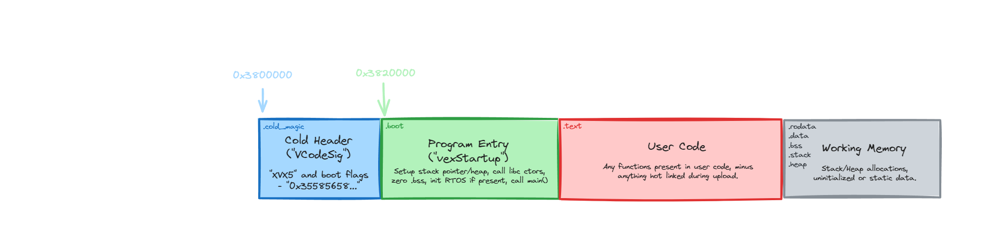

# Startup

vexide produces working binaries without linking to any external libraries. This means that we have to write all of the code that gets run during startup.

The boot process for programs works as such:

1) VEXos loads the program into memory at 0x3800000
2) VEXos reads the program's code signature and changes program behavior accordingly.
3) VEXos sets up a [default stack](./environment/#stack-sizes) and begins program execution at 0x3800020 (the address just after the code signature)
4) vexide sets up a larger stack, runs its program patch routine (which supports differential uploading), and jumps to the Rust std library entrypoint
5) The user's main function calls vexide's post-main startup routine, wherein vexide sets up the heap and starts the async executor

## Explanations

The structure of a user program looks like this:

### Steps 1-3

Before we can even get to step one we need to get a program building correctly. Some of vexide's features including differential uploading and custom code signatures require changes to the program memory layout. As such, the vexide-startup crate contains a `vexide.ld` linker script which tells the linker where the program's patch file and code signature is located. This builds on Rust's builtin linker script for VEX V5 that tells it how to lay out each section in a program.

The only parts of the linker script that are important to understand for the first three steps are in the `.text` section:

- `.vexide_boot` is located at `0x3800020` and is the entrypoint to the program.
- `.code_signature` is located at the very start of user memory (`0x3800000`) and it stores information that VEXos uses to change the behavior of the program. PROS calls this the cold magic / cold header.

The first four bytes of the code signature must be the string `XVX5` encoded in ASCII. The rest of the 32 bytes are used for various program options. For more detailed information, look at the docs for the `CodeSignature` struct in vexide.

### Step 4

vexide defines a function named `_vexide_boot` which is placed in the `.vexide_boot` section previously discussed. VEXos jumps into it at the beginning of a user program, it uses assembly code to set the stack pointer, check whether a patch file is loaded into memory, run the program patcher if needed, and eventually jump to the Rust entrypoint `_start` (which is defined in the source code for `std`).

The program patcher is used as a workaround for the fact that VEXos doesn't allow you to edit files on the system, only completely overwrite them, which makes uploading changes very slow. In summary, instead of uploading a program like normal, we instead upload one only consisting of a `bipatch` file which loads itself at a specific address and defines a link to the main program binary (which loads itself at the normal start address, `0x3800000`). This makes use of a VEXos feature called Linked Files, which is discussed in more detail in the [PR that added support for it to rustc](https://github.com/rust-lang/rust/pull/145578).

### Step 5

Step five is pretty simple because at this point we're well into the vanilla Rust `main()` function and can run any code that doesn't allocate on the heap.
In fact, we use these newfound capabilities to do the incredibly important task of printing our banner. 🏳️‍🌈

Currently, we override Rust's default allocator and use [Talc](https://crates.io/crates/talc) for our heap because it seems to be a bit better optimized.
We pass it a range of memory from the start of the heap defined in Rust's linker script all the way to the end.

Spinning up the executor is straightforward. We just call `vexide_async::block_on` on the user's entrypoint.

And with that, we have a booting program!
