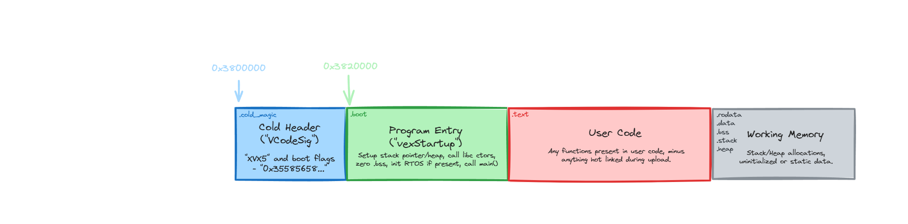

# Startup

vexide produces working binaries without linking to any external libraries.
This means that we have to write all of the code that gets run during startup.
Luckily program startup is fairly simple, its just a pain to set up.

The boot process for programs works as such:
1) VEXos loads the program into memory at 0x3800000
2) VEXos reads the cold header and changes program behavior accordingly.
3) VEXos starts program execution at 0x3800020 (the address just after the cold header)
4) vexide zeroes the entire BSS section and sets the stack pointer to the bottom of the stack
5) vexide initializes the heap allocator
6) vexide starts the async executor and the users main function inside it

## Explanations

The structure of a user program looks like this:


In order to explain the startup code, I will be going over every one of these six steps and how they are implemented.

### Steps 1-3

Before we can even get to step one we need to get a program building correctly.
The vexide-startup crate contains a v5.ld file that tells clang how to link vexide programs correctly.
It tells the linker where cold memory is located and the locations of all of the sections necessary for running programs.
The only parts of the linker script that are important to understand for the first three steps are in the `.text` section.

Specifically the `.boot` and `.cold_magic` sections are important.
`.boot` is located at 0x3800020 and is the entrypoint to the program.
`.cold_magic` is located at the very start of cold memory (0x3800000) and it stores information that VEXos uses to change the behavior of the program.
In vexide, we call this "cold_magic" the cold header because it is a more fitting name.
The name ``cold_magic`` originates from PROS, but it exists in vexcode under the name ``VCodeSig``.
The first four bytes of the cold header must be the string ``XVX5`` encoded in ascii. The rest of the 32 bytes are used for various program options.
For more detailed information, look at the docs for the `ColdHeader` struct in vexide.

After this build process, steps 1-3 work as intended.

### Step 4

This step is the first, and only, time that assembly is required. Yay!

vexide sets the stack pointer with this inline assembly:
```asm
ldr sp, =__stack_start
```
This instruction loads the value of ``=__stack_start`` into ``sp`` (the stack pointer register).
The symbol ``__stack_start`` is defined by the v5.ld linker script and the name is pretty self-explanatory.

The next task is to zero the BSS section. vexide uses a loop that increments a pointer to achieve this effect.
```rust
unsafe {
    let mut bss_start = addr_of_mut!(__bss_start);
    while bss_start < addr_of_mut!(__bss_end) {
        core::ptr::write_volatile(bss_start, 0);
        bss_start = bss_start.offset(1);
    }
}
```
You may think this seems horribly unsafe, and you would be right under normal circumstances;
however, at this point nothing has set any values in the BSS section and it must be zeroed to avoid corruption.

### Step 5-6

Steps five and six are pretty simple because at this point we can run any code that doesn't use the heap.
In fact, we use these newfound capabilities to do the incredibly important task of printing our banner. 🏳️‍🌈

Currently, we use [Talc](https://crates.io/crates/talc) for our heap allocator.
We pass it a range of memory from the start of the heap defined in the linker script all the way to the end.
Our linker script allocates the largest amount of memory that it can for the heap so vexide programs have the most memory of any V5 Brain library.

Spinning up the executor is straightforward. We just call `vexide_async::block_on` on the users main function.

And with that, we have a booting program!